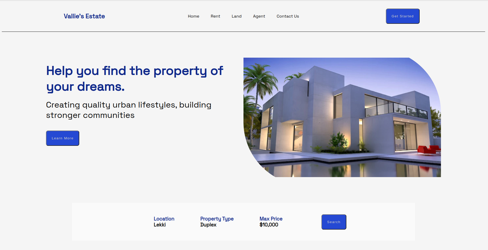

# Vallie's Estate
A real estate website to help you find the property of your dream

See it [Live](https://collinskigen.github.io/vallie-estate/)
## Setup
To run this project locally, follow these steps;
### Step 1:
Clone this repository by running the below command on your terminal
```
git@github.com:collinskigen/vallie-estate.git
```
### Step 2:
Copy the full path of the 'index.html' file then paste on the browser search bar.
## Screenshot


## Credits
* Collins Kigen, collins.kigen@student.moringaschool.com (Author)
* Moringa school

## Licence
MIT License. This project is freely available to anyone. Provide credit where its due.

&copy;2022, Collins Kigen 